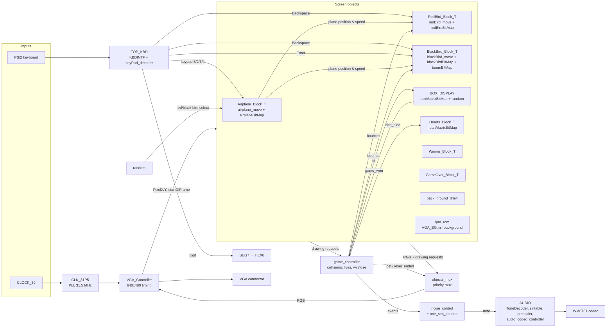

# Angry Birds on FPGA (SystemVerilog)

A hardware version of an Angry Birds–style game for the Terasic **DE10-Standard** board (Intel Cyclone V). Every part runs in FPGA logic, with no CPU or software. The game logic, the 640×480 VGA output, the PS/2 keyboard input and the sound are all written in SystemVerilog and Quartus block schematics (`.bdf`).

You fly an airplane across the top of the screen with the keyboard and drop a bird from it. The bird keeps the plane's horizontal speed and falls under gravity. It bounces off boxes and walls and knocks out the pigs. You win the level when every pig is gone. You lose after three birds die.

Built for the Technion course **00440157 Electrical Engineering Lab 1a**.

<!-- Demo GIF / photo placeholder: put a file in docs/ and uncomment

-->

---

## Hardware and tools

| | |
|---|---|
| Board | Terasic DE10-Standard |
| FPGA | Intel Cyclone V SX, `5CSXFC6D6F31C6` |
| Toolchain | Intel Quartus Prime **17.0** Lite Edition |
| Languages | SystemVerilog, plus Quartus block schematics (`.bdf`) and Intel IP (ALTERA_PLL, LPM_ROM, LPM_CONSTANT) |
| Simulation | Quartus waveform files (`.vwf`) run with ModelSim-Intel |
| Video | VGA 640×480, 8-bit colour, 31.5 MHz pixel clock from an on-chip PLL |
| Input | PS/2 keyboard (numeric keypad, Backspace, Enter) and push-button `KEY[3]` |
| Audio | WM8731 audio codec on the board (sine-table tone generator) |
| Display | 7-segment `HEX0` shows the last keypad digit pressed |

## Controls

| Key | Action |
|---|---|
| Keypad **8** / **2** | Move the airplane up / down |
| Keypad **6** / **4** | Make the airplane faster / slower |
| **Backspace** | Drop the bird. It can only be dropped while the plane's X position is between 0 and 450. |
| **Enter** | Black bird only: trigger the "boom" special ability |

When the design resets, a random number generator chooses whether the plane carries the **red bird** or the **black bird**. The airplane sprite changes to match.

---

## Architecture

The top level is the schematic [`rtl/VGA/TOP_VGA_DEMO_KBD.bdf`](rtl/VGA/TOP_VGA_DEMO_KBD.bdf). Each on-screen object is a `*_Block_T` sub-schematic built the same way:

- a **`square_object`** checks whether the current pixel is inside the object's box;
- a **`*BitMap`** holds the sprite and returns its colour, plus a transparency flag;
- for moving objects, a **`*_move`** state machine updates the position once per frame.



### Module hierarchy

```
TOP_VGA_DEMO_KBD
├── CLK_31P5                 (IP) PLL, 50 MHz → 31.5 MHz pixel clock; its lock signal is the global reset
├── VGA_Controller           sync generator, pixel coordinates, startOfFrame, ROM address
├── lpm_rom                  background image ROM, initialised from assets/VGA_BG.mif
├── back_ground_draw         border and background colour
├── TOP_KBD                  KBDINTF (precompiled .qxp) + keyPad_decoder
├── Airplane_Block_T         square_object, airplaneBitMap, airplane_move
├── RedBird_Block_T          square_object, redBirdBitMap, redBird_move
├── BlackBird_Block_T        2× square_object, blackBirdBitMap, boomBitMap, blackBird_move, 2× BUSMUX
├── BOX_DISPLAY              square_object, random, boxMatrixBitMap
├── Hearts_Block_T           square_object, heartMatrixBitMap
├── Winner_Block_T           square_object, WinnerBitMap
├── GameOver_Block_T         square_object, gameOverBitMap
├── game_controller
├── objects_mux
├── random                   red/black bird selection
├── noise_control
├── one_sec_counter
├── AUDIO                    prescaler, ToneDecoder, sintable, addr_counter, audio_codec_controller
└── SEG7
```

### Main modules

**`VGA_Controller`** creates 640×480 VGA timing from the 31.5 MHz pixel clock. It outputs the current `PixelX`/`PixelY`, a one-clock `startOfFrame` pulse that drives all the game physics, and the address for the background-image ROM. It turns the 8-bit internal colour into the 24-bit RGB plus sync bus (`OVGA[28:0]`).

**`objects_mux`** chooses which object's colour is shown for each pixel. The priority, highest first, is: *Winner* screen (once the level is won), *Game Over* screen (once the game is lost), bird, airplane, hearts, boxes/pigs, border, and finally the background picture from ROM.

**`airplane_move`** is a state machine that moves the 128×128 airplane once per frame. Positions use fixed point with 1/64-pixel resolution.
- Horizontal speed starts at 100. Each press of keypad 6 or 4 changes it by 15, between a minimum of 100 and a maximum of 400.
- The plane wraps around from the right edge back to the left.
- Keypad 8/2 move it up or down, but it stays in the top half of the screen.
- It outputs its speed so the bird starts with the plane's momentum.

**`redBird_move` / `blackBird_move`** run the bird's physics, again in 1/64-pixel fixed point. Their states are `IDLE → MOVE → START_OF_FRAME → POSITION_CHANGE → POSITION_LIMITS`.
- While idle, the bird rides along with the airplane.
- After it is dropped, it inherits the plane's X speed and falls with gravity: +10 per frame, up to a maximum speed of 500.
- During each frame, the module records which edge of the bird was hit, using a 4-bit hit code from the sprite's hit map. At the start of the next frame it bounces the bird off that edge or corner, halving the speed.
- If the bird leaves the screen, it **dies**. It then resets onto the plane and one life is lost.
- **Red bird:** shows an "angry" sprite while it is in the lower-right part of the screen (x > 250, y > 200).
- **Black bird:** pressing **Enter** freezes the bird and switches it to a 64×64 explosion sprite (`boomBitMap`). After 20 frames the bird is moved off-screen.

**`boxMatrixBitMap`** holds the level. The screen is divided into a 16×16 grid of 32×32-pixel tiles, and each tile is empty, a box, a pig, or a third block type.
- At reset, one of **6 built-in level layouts** is picked using a value from `random`.
- When the bird hits a **box**, that box is removed and the tiles stacked above it drop down one row. The bird bounces.
- When the bird hits a **pig**, the pig is removed.
- Hitting the third block type counts as a wall hit, and the bird bounces.
- The module scans the whole grid continuously and raises `game_won` once no pig is left.

**`game_controller`** combines the drawing requests from the bird, the border and the boxes into a `collision` signal. It sends a bounce to the bird only when a box or wall was hit, and passes `bird_died` on as a bird reset. It counts deaths and asserts `lost` after **3** deaths. It passes `game_won` on as `level_ended`.

**`heartMatrixBitMap`** draws the lives counter: three hearts in the top-left corner, with one removed after each death.

**`noise_control` + `AUDIO`** handle sound. A state machine plays short notes on game events: a bounce, any collision, a red bird dying, a black bird dying, and winning. Each note lasts one tick of `one_sec_counter`. `ToneDecoder` turns the note number into a prescaler value, and `sintable` creates a sine wave that `audio_codec_controller` sends to the WM8731 codec. Sound is muted once the game is won or lost.

**Keyboard (`TOP_KBD`)** has two parts. `KBDINTF` is a precompiled PS/2 interface delivered as a Quartus partition (`.qxp`). `keyPad_decoder` turns its scan codes into separate key-pressed signals for keypad digits 0–9 and for keys such as Enter and Backspace.

**Collision method.** Each sprite has a coarse 8×8 "hit-edge" map that tells which side of the object a pixel belongs to. A collision is detected when two objects request the same pixel during a frame. The bird's state machine applies the response once per frame, at `startOfFrame`.

---

## Build results

These numbers come from the last full compile of `TOP_VGA_DEMO_KBD` with Quartus Prime 17.0 Lite (fitter and TimeQuest reports, January 2025).

### Resource usage (5CSXFC6D6F31C6)

| Resource | Used | Available | % |
|---|---:|---:|---:|
| Logic (ALMs) | 6,658 | 41,910 | 16 % |
| Registers | 2,404 | – | – |
| Block memory bits | 2,458,240 | 5,662,720 | 43 % |
| RAM blocks (M10K) | 301 | 553 | 54 % |
| DSP blocks | 0 | 112 | 0 % |
| PLLs | 1 | 15 | 7 % |
| I/O pins | 62 | 499 | 12 % |

Almost all of the block memory holds the 640×480×8-bit background image (2,457,600 bits).

### Timing (Slow 1100 mV 85 °C model)

| Clock | Required | Fmax | Worst setup slack | Worst hold slack |
|---|---:|---:|---:|---:|
| `CLOCK_50` | 50 MHz | 182.52 MHz | **−4.929 ns** | 0.360 ns |
| PLL pixel clock | 31.5 MHz | 61.0 MHz | 15.353 ns | 0.322 ns |
| `altera_reserved_tck` (JTAG / SignalTap) | 25 MHz | 51.55 MHz | 10.300 ns | 0.333 ns |

> **Timing was not fully met.** TimeQuest reports *"Timing requirements not met"*: worst setup slack is −4.929 ns, with −38.458 ns total negative slack on `CLOCK_50`. Every failing path crosses from the 31.5 MHz pixel-clock domain into the `CLOCK_50` domain, which only the keyboard interface uses. These signals are not synchronised and the clocks are not declared asynchronous. Paths within a single clock all have positive slack, and each clock's Fmax is well above its target. A clean build would need a synchronizer or a `set_clock_groups -asynchronous` constraint.

---

## Repository layout

```
.
├── constraints/   Quartus project (.qpf/.qsf), timing constraints (.sdc), pin script, SignalTap file
├── rtl/           SystemVerilog sources and .bdf schematics
│   ├── VGA/         game objects, VGA controller, game controller, mux
│   ├── pictures/    airplane bitmap
│   ├── KEYBOARDX/   keypad decoder, random generator
│   ├── AUDIO/       tone generator and WM8731 codec controller
│   ├── Seg7/        7-segment decoder
│   └── ip/          PLL (CLK_31P5), LPM constants, precompiled keyboard interface (KBDINTF.qxp)
├── assets/        VGA_BG.mif – background image ROM contents
├── sim/           Quartus waveform simulation files (.vwf)
└── docs/          photos / demo media
```

## Building and running

1. Install **Intel Quartus Prime 17.0 Lite** and include Cyclone V device support.
2. Open `constraints/Lab1Demo.qpf` (**File → Open Project**). The top-level entity is `TOP_VGA_DEMO_KBD`.
3. Run **Processing → Start Compilation**. Build outputs go to `constraints/output_files/`.
4. Connect a VGA monitor, a PS/2 keyboard and, if you want sound, speakers or headphones to the line-out jack of the DE10-Standard.
5. Open **Tools → Programmer**, choose the USB-Blaster, and load `constraints/output_files/Lab1Demo.sof`.

**Simulation:** open a file from `sim/` in the Quartus Waveform Editor and run **Simulation → Run Functional Simulation**. Most of these waveforms were made for testing one module (for example `blackBird_move`). To run them, first set that module as the top-level entity.

> Several modules (`one_sec_counter`, `fastClock`) contain a `_REAL` / `_SIM` constant. Switch it to the `_SIM` value to get short counter periods in simulation.

---

## Team

- **Razan Jiryis**
- **Bshara Awwad**

## Credits

This project builds on the lab framework provided by the Technion Faculty of Electrical and Computer Engineering. The VGA controller, the `square_object` and bitmap templates, the object mux, the base movement state machine, the audio codec/tone generator, the keyboard decoder and the 7-segment decoder come from course templates by Alex Grinshpun, David (Dudy) Bar-On and Eyal Lev. The original headers are kept in each of those files. The game logic, sprites, level layouts and the changes to the templates were written for this project.

## Photos

<!-- Add photos of the board and monitor here, e.g.


-->
*Photos and a demo video will be added.*
